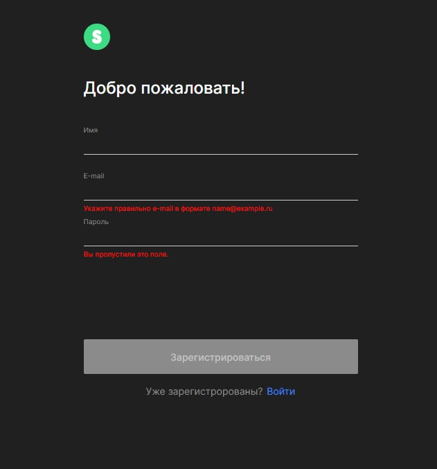
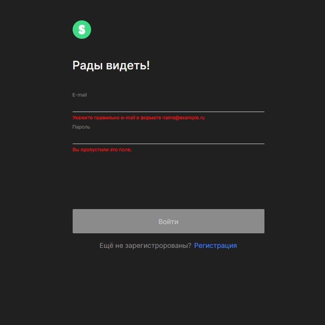
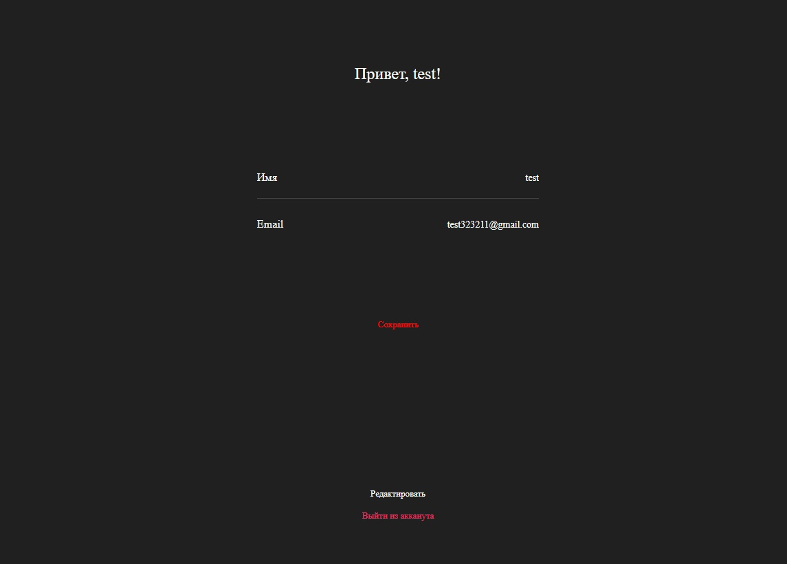
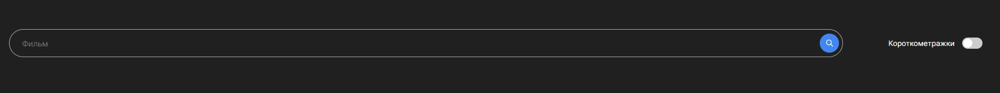
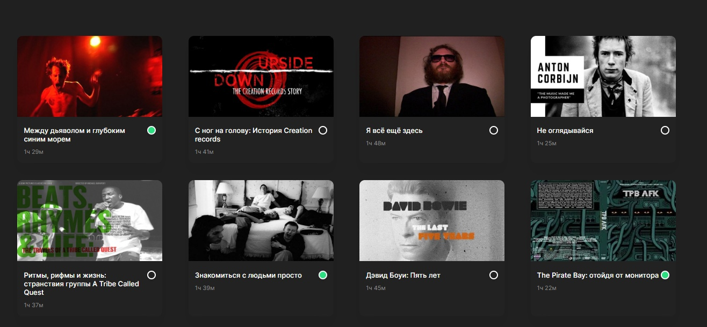
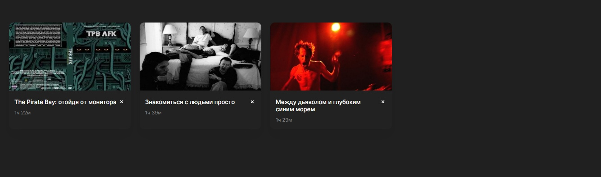

# Проект: Сервис по поиску фильмов (Frontend)

- дипломный проект, выполненный как заключительная работа на курсе "Веб-разработчик" от Яндекс.Пратикум. В данном репозитории реализована frontend часть проекта. Также была написана [backend часть](https://github.com/IlyaBiryulev/movies-explorer-api).

## Содержание

 - [Обзор проекта](#обзор-проекта)
    - [Задачи и цели](#задачи-и-цели-проекта)
    - [Функциональность проекта](#функциональность-проекта)
    - [Ссылки](#ссылки)
    - [Директории проекта](#директории-проекта)
    - [Запуск прокета](#запуск-проекта)
 - [Технологии](#технологии)
 - [Автор](#автор)

## Обзор проекта

### Задачи и цели проекта

Задачами проекта являлись практика полученных навыков по Frontend, разработка с помощью фреймворка React и работа с React Router.
К целям проекта относятся верстка с помощью сгенирированного макета в Figma и написание функционала приложения.

### Функциональность проекта

Проект представляет лендинг с портфолио, а также сервис поиска фильмов по названию и длительности фильма(полнометражный и короткометражный).
В работе реализованы регистрация и авторизация пользователя, если регистрация была пройдена успешно, пользователя сразу авторизует и перенаправит на страницу с фильмами.

Во вкладке "Акканут" пользователь при необходимости может изменить свои данные. Для всех полей форм сделана валидация.

На странице "Фильмы" и "Сохраненные фильмы" реализован поиск по названию фильма, а также возможнсть филтрации фильмов по длительность. Реализована возможность сохранения и удаления понравившегося фильма. При нажатии на постер фильма, происходить перенаправление на трейлер.

### Ссылки

[Макет сайта](https://disk.yandex.ru/d/mxYYO8D_TvSQYw)

[Ссылка на страницу сайта](https://moviedomen.nomoredomains.rocks)

[Ссылка на Frontend](https://github.com/IlyaBiryulev/movies-explorer-frontend)

[Ссылка на Backend](https://github.com/IlyaBiryulev/movies-explorer-api)

### Директории проекта

- `src/components` — компоненты проекта
- `src/contexts` — элементами контекста
- `src/utils` — директория с api, константами и вспомогательными функциями проекта
- `src/images` — изображения
- `src/vendor` — директория с файлами библиотек
- `/fonts` — директория со шрифтами

### Запуск проекта

- `npm run build` — запуск проекта в режиме продакшн
- `npm start` — запуск проекта в режиме разработки

## Технологии

- HTML
- CSS
- JS
- React
- React Router
- Create React App
- Адаптивная вёрстка
- Семантическая вёрстка

## Автор

Илья Бирюлев

- e-mail: birulevila@gmail.com
- tg: [@ilya_bir](https://t.me/ilya_bir)

